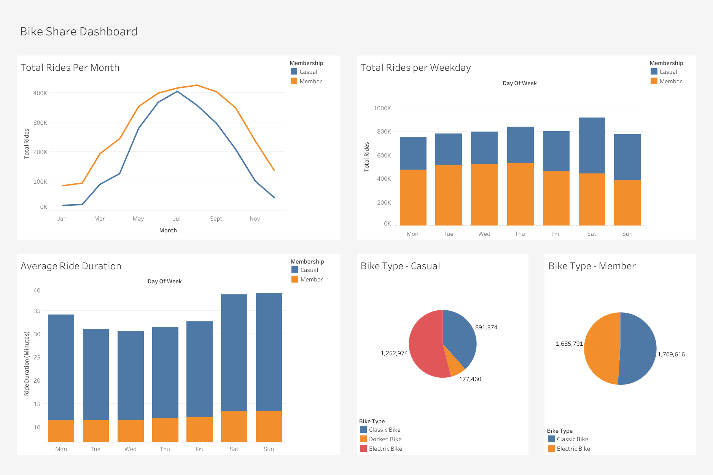

# Data Analytics Case Study

Data analytics case study of a bike-share company with data collection, data cleaning, analysis, and data visualisation. Developed with Microsoft Excel, PostgreSQL, and Tableau.

## Case Study

### Ask

- How do annual members and casual riders use Cyclistic bikes differently?
- Why would casual riders buy Cyclistic annual memberships?
- How can Cyclistic use digital media to influence casual riders to become members?

### Prepare

- Download previous 12 months of Cyclistic trip data

### Process

- Open .CSV files in Excel
- Create column called "ride_length" using "=D2-C2" and format as HH:MM:SS.
- Create column called "day_of_week" using "=WEEKDAY(C2,1)" and format as General.

### Analyse

- CREATE tables for each month using PostgreSQL.
- COPY data from .CSV into tables.
- UNION tables together into a year long table.
- SELECT summary statistics and save to a table.

### Share

- Create data visualisation using Tableau.

### Act

- Upload case study findings to portfolio.

## Screenshot

## Built With

- Microsoft Excel - Spreadsheet software
- PostgreSQL - Open-source relational database management system
- Tableau - Data visualisation software

## Authors

- Fardeen Hossain

## License

This project is licensed under the MIT License - see the LICENSE.md file for details.
